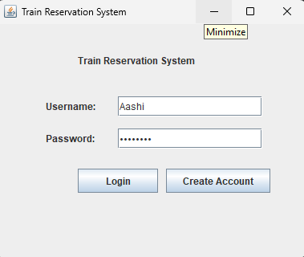
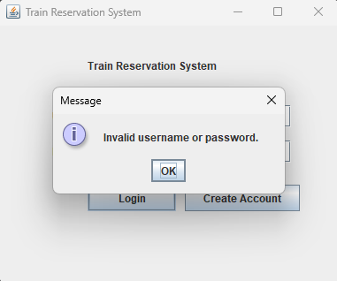
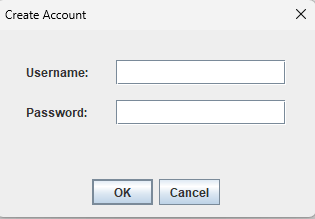
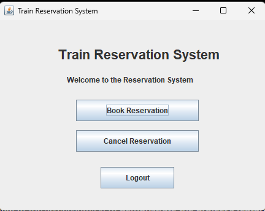
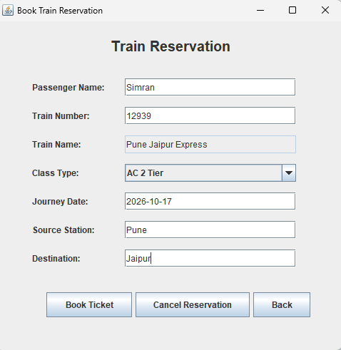
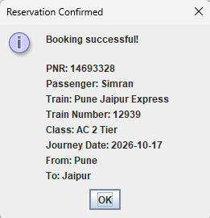
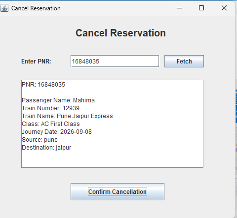
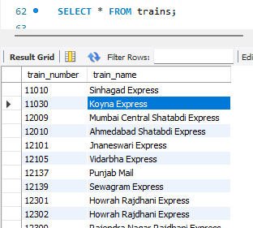
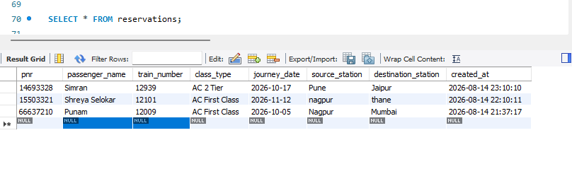
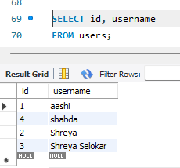

# 🚆 Online Reservation System - Java Swing

A desktop-based **Online Reservation System** developed using Java Swing. The application allows users to create an account, log in, search for trains, make reservations, cancel reservations, and manage their sessions. The system uses MySQL for database storage and JDBC for database connectivity.

## ✨ Features

* 🔐 User Login and Authentication
* 🚫 Access Denied Message for Invalid Login
* 📝 New User Account Creation
* 🏠 User Dashboard
* 🚆 Train Search and Selection
* 🎫 Train Reservation
* 👤 Passenger Details
* ✅ Booking Confirmation
* ❌ Reservation Cancellation
* 🚪 Logout
* 🗄️ MySQL Database Integration
* 🔗 JDBC Connectivity
* ⚠️ Input Validation and User Feedback

## 🛠️ Technologies Used

* Java 21
* Java Swing
* JDBC
* MySQL
* Maven
* IntelliJ IDEA

## 📁 Project Structure

```text
JavaDev-Task1-OnlineReservationSystem/
├── src/
│   └── main/
│       ├── java/
│       └── resources/
│
├── database/
│   └── reservation_system.sql
│
├── screenshots/
│   ├── 01_Login.png
│   ├── 02_Access-Denied.png
│   ├── 03_CreateAccount.png
│   ├── 04_dashboard.png
│   ├── 05_reservation.png
│   ├── 06_booking_confirmation.png
│   ├── 07_cancellation.png
│   ├── 08_database-train.png
│   ├── 09_database-reservation.png
│   └── 10_database-user.png
│
├── README.md
├── pom.xml
└── .gitignore
```

## 🗄️ Database Setup

The project uses **MySQL**.

### 1. Create the Database

The complete SQL script is available in:

```text
database/reservation_system.sql
```

Run this file in **MySQL Workbench** or another MySQL client.

It creates:

* `reservation_system` database
* `users` table
* `trains` table
* `reservations` table
* Sample user data
* Sample train data

## ⚙️ Database Configuration

Database connection details are stored in:

```text
src/main/resources/config.properties
```

Example:

```properties
db.url=jdbc:mysql://localhost:3306/reservation_system
db.username=root
db.password=123
```


## ▶️ How to Run

### IntelliJ IDEA

1. Open the project in IntelliJ IDEA.
2. Configure Java 21.
3. Make sure MySQL Server is running.
4. Run `database/reservation_system.sql` in MySQL.
5. Configure `src/main/resources/config.properties` with your MySQL username and password.
6. Reload the Maven project.
7. Open `LoginFrame.java`.
8. Run the `LoginFrame` class.

## 🎮 How to Use

1. Create a new account or log in using an existing account.
2. Access the dashboard after successful login.
3. Select the reservation option.
4. Search for and select a train.
5. Enter the required passenger details.
6. Confirm the reservation.
7. View the booking confirmation.
8. Use the cancellation option to cancel an existing reservation.
9. Logout after completing the required operations.

## 🔑 Sample Login

A sample user is available in the database for testing.

```text
Username: aashi
```

The password is configured in the local database and is not published in this repository.

A new account can also be created from the login screen.

## 📸 Screenshots

### Login



### Access Denied



### Create Account



### Dashboard



### Reservation



### Booking Confirmation



### Cancellation



### Train Database



### Reservation Database



### User Database



## 🎓 Internship

**OIBSIP - Java Development Internship**

**Task 1 - Online Reservation System**
