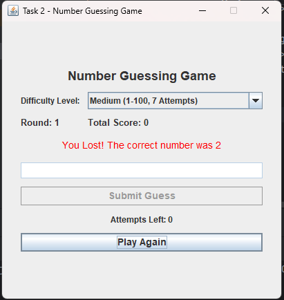

# 🎯 Number Guessing Game - Java Swing

A desktop-based Number Guessing Game developed using Java Swing. The player tries to guess a randomly generated number and receives hints after each attempt.

## ✨ Features

- 🎲 Random number generation
- 🎚️ Three difficulty levels:
  - Easy: 1-50, 10 attempts
  - Medium: 1-100, 7 attempts
  - Hard: 1-200, 5 attempts
- 🔼 "Too High!" and 🔽 "Too Low!" hints
- ✅ Correct guess notification
- ❌ "You Lost!" message when attempts are exhausted
- 🔢 Attempts remaining displayed
- 🏆 Score tracking across rounds
- 🔄 Play Again option
- 📊 Round number and total score
- ⚠️ Input validation for invalid and out-of-range values

## 🛠️ Technologies Used

- Java
- Java Swing
- AWT
- Random

## 📁 Project Structure

```text
JavaDev-Task2-NumberGuessingGame/
├── src/
│   └── NumberGuessingGame.java
├── Screenshot/
│   └── Output.png
├── README.md
└── .gitignore
```

## ▶️ How to Run

### IntelliJ IDEA

1. Open the project in IntelliJ IDEA.
2. Configure a Java JDK.
3. Open src/NumberGuessingGame.java.
4. Run the NumberGuessingGame class.

### Command Line

Compile:

    javac -d out src/NumberGuessingGame.java

Run:

    java -cp out NumberGuessingGame

## 🎮 How to Play

1. Select a difficulty level.
2. Enter a number within the displayed range.
3. Click Submit Guess.
4. Use the hints to make your next guess.
5. Continue until you guess the number or run out of attempts.
6. Click Play Again to start a new round.

## 📸 Screenshot



## 🎓 Internship

OIBSIP - Java Development Internship

Task 2 - Number Guessing Game
