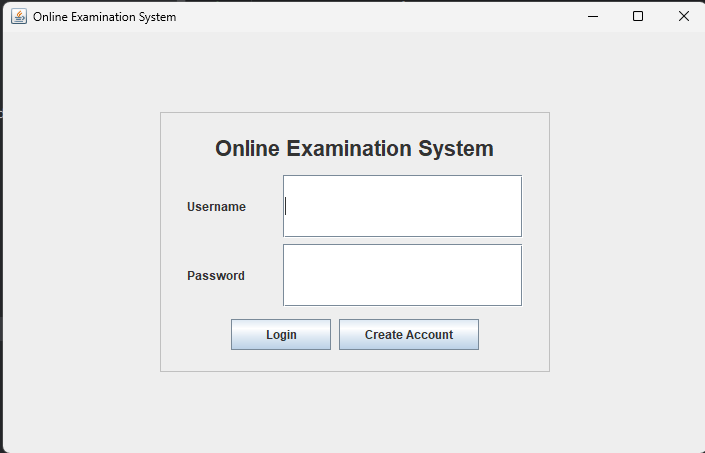
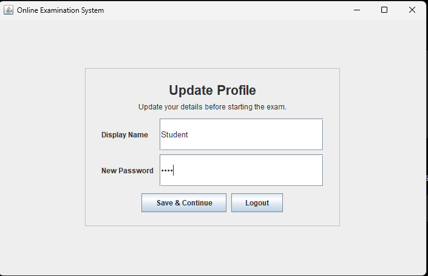
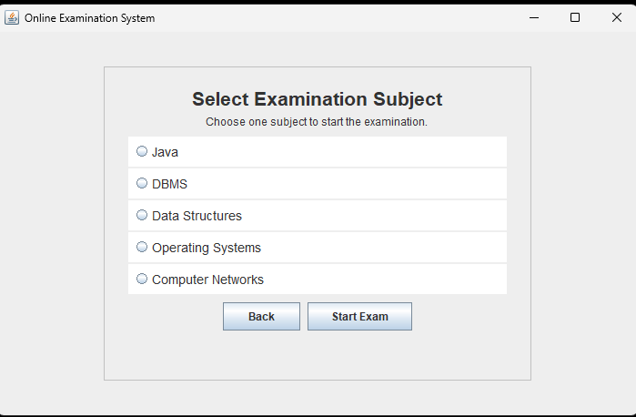
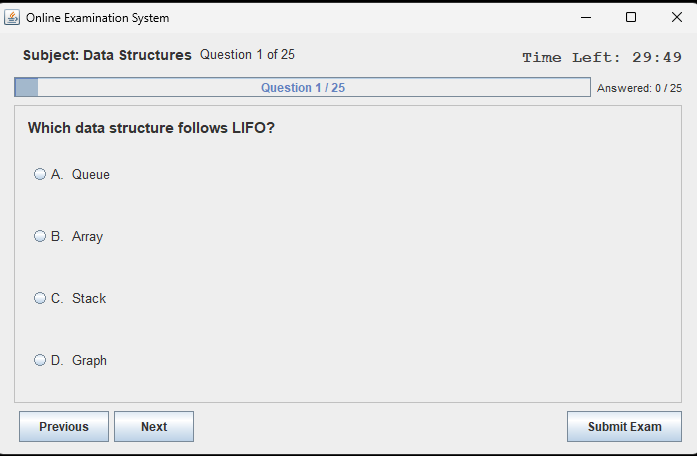
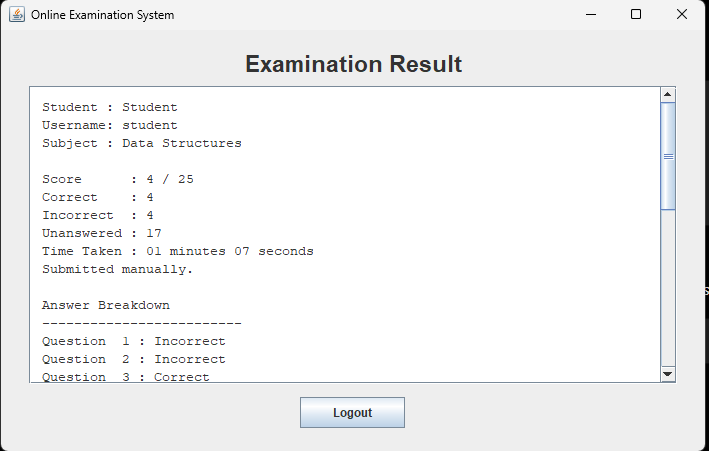

# 📝 Online Examination System - Java Swing

A desktop-based Online Examination System developed using Java Swing. The application allows students to log in, update their profile, select a subject, attempt multiple-choice questions within a time limit, and view their results.

## ✨ Features

- 🔐 User registration and login
- 👤 Profile update with display name and password
- 📚 Five examination subjects:
  - Java
  - DBMS
  - Data Structures
  - Operating Systems
  - Computer Networks
- ❓ 25 multiple-choice questions per subject
- 🔘 Four options for each question
- ◀️▶️ Next and Previous navigation
- 📊 Answered-question counter and progress bar
- ⏱️ 30-minute countdown timer
- 🤖 Automatic submission when the timer expires
- 📤 Manual submission with confirmation
- 🏆 Result showing score, correct, incorrect, and unanswered questions
- ⌛ Time taken displayed on the result screen
- ⚠️ Quit confirmation during an active examination
- 🚪 Logout option

## 🛠️ Technologies Used

- Java
- Java Swing
- AWT
- Java Collections Framework
- javax.swing.Timer

## 📁 Project Structure

```text
JavaDev-Task4-OnlineExaminationSystem/
├── src/
│   ├── Main.java
│   ├── ExamApplication.java
│   ├── User.java
│   ├── UserStore.java
│   ├── Question.java
│   └── QuestionBank.java
├── screenshots/
│   ├── 01_Login.png
│   ├── 02_Profile-update.png
│   ├── 03_Subject-selection.png
│   ├── 04_Examination.png
│   └── 05_Result.png
├── README.md
└── .gitignore
```

## ▶️ How to Run
### IntelliJ IDEA

1. Open the project in IntelliJ IDEA.
2. Configure a Java JDK.
3. Open src/Main.java.
4. Run the Main class.

### Command Line

Compile:

    javac -d out src/*.java

Run:

    java -cp out Main

## 🔑 Demo Login

Username: student

Password: 1234

A new account can also be created using the Create Account option.

## 💾 Data Storage

The application does not require an external database.

User information and examination questions are stored in memory while the application is running.

## 📸 Screenshots

### 1. Login


### 2. Profile Update


### 3. Subject Selection


### 4. Examination


### 5. Result


## 🎓 Internship

OIBSIP - Java Development Internship

Task 4 - Online Examination System
